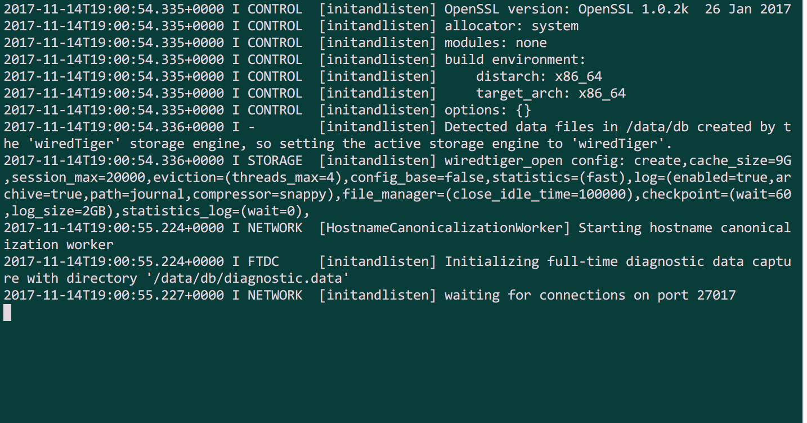

# How to set up a Linux Dev environment

### Install Git

Open up your terminal and run the following commands in this order:

`$ sudo apt-get update`

`$ sudo apt-get upgrade`

`$ sudo apt-get install git`

You can see if it worked by typing:

`$ git --version`

And you should see a version number. If not, you may need to close and reopen your terminal application and then try `$ git --version` again.

## A Better Terminal Application

Type the following commands to install a better terminal application called Terminator:

`$ sudo add-apt-repository ppa:gnome-terminator`

`$ sudo apt-get update`

`$ sudo apt-get install terminator`

### Install NVM (Node Version Manager) and Node

So far you could only run JavaScript code on a web browser, attached to an HTML page. Node.js allows us to run JavaScript code directly from our terminal. We'll use Node.js extensively during the course and on the Precourse so it's important to have an up-to-date version installed.

Run this command in your terminal to install Node Version Manager which allows you to easily download the latest version of Node, and switch between versions at a later date if you need to:

`$ curl -o- https://raw.githubusercontent.com/creationix/nvm/v0.33.6/install.sh | bash`

Check it has installed correctly by typing this command on the terminal:

`$ nvm --version`

Again, if you see a version number you are good.

Now install Node using NVM:

`$ nvm install node`

`$ nvm use node`

You may need to quit and reopen your terminal application before you see it has been successful. To check success, type:

`$ node --version`

If you have an earlier version than 6, type:

`$ nvm install 8.6.0`

`$ nvm use 8.6.0`

`$ node --version` 

Now you should see that you are using Node version 8.6.0

## MongoDB

Now for MongoDB, a database we'll be using during the course. Don't worry if this doesn't seem to go as you planned, you won't need it for the Precourse and we can sort you out at the install session!

Run the following commands in this order:

`$ sudo apt-key adv --keyserver hkp://keyserver.ubuntu.com:80 --recv 0C49F3730359A14518585931BC711F9BA15703C6`

`$ echo "deb [ arch=amd64,arm64 ] http://repo.mongodb.org/apt/ubuntu xenial/mongodb-org/3.4 multiverse" | sudo tee /etc/apt/sources.list.d/mongodb-org-3.4.list`

`$ sudo apt-get update`

`$ sudo apt-get install -y mongodb-org`

Comfirm it has worked by running:

`$ sudo service mongod start`

You should see something like this:

You can then stop the service by hitting Ctrl + C

### Install PostgreSQL

PostgreSQL is another database we'll use during the course. Again, don't worry if this doesn't seem to go as you planned, you won't need it for the Precourse and we can sort you out at the install session!

Run this command in your terminal:

`$ sudo apt-get install postgresql postgresql-contrib`

And that's it!