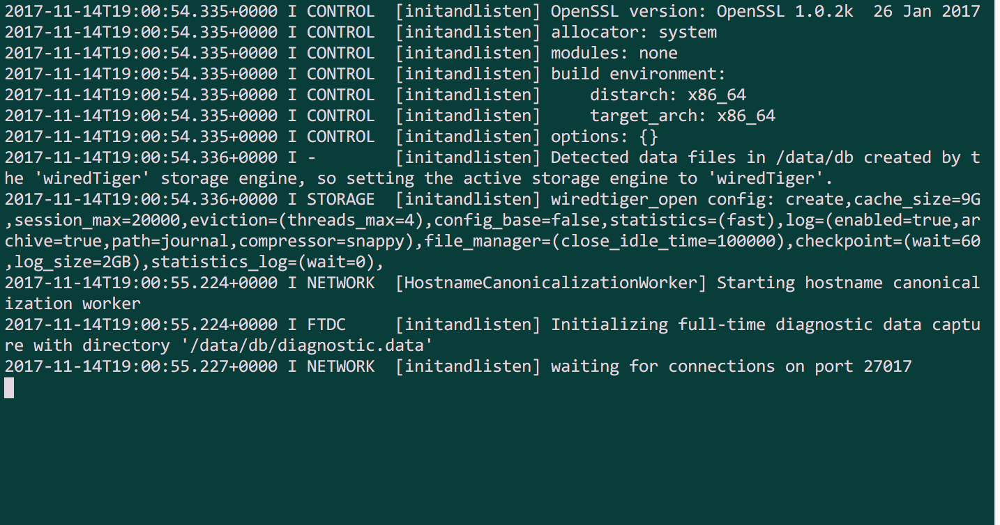

# How to setup an OSX dev environment

### Install Homebrew

Run this command on your terminal application to install Homebrew:

`$ /usr/bin/ruby -e "$(curl -fsSL https://raw.githubusercontent.com/Homebrew/install/master/install)"`

Update Homebrew:

`$ brew update`

### Install Git

See if you already have Git by running:

`$ git --version`

If you already have Git it will tell you a version number.

If you do not see a version number, install Git with Homebrew:

`$ brew install git`

Run `$ git --version` again to confirm Git has been installed.

### Install NVM (Node Version Manager) and Node

So far you could only run JavaScript code on a web browser, attached to an HTML page. Node.js allows us to run JavaScript code directly from our terminal. We'll use Node.js extensively during the course and on the Precourse so it's important to have an up-to-date version installed.

Run this command in your terminal to install Node Version Manager which allows you to easily download the latest version of Node, and switch between versions at a later date if you need to:

`$ curl -o- https://raw.githubusercontent.com/creationix/nvm/v0.33.6/install.sh | bash`

Check it has installed correctly by typing this command on the terminal:

`$ nvm --version`

Again, if you see a version number you are good.

Now install Node using NVM:

`$ nvm install node`

`$ nvm use node`

You may need to quit and reopen your terminal application before you see it has been successful. To check success, type:

`$ node --version`

If you have an earlier version than 6, type:

`$ nvm install 8.6.0`

`$ nvm use 8.6.0`

`$ node --version` 

Now you should see that you are using Node version 8.6.0

### MongoDB

Now for MongoDB, a database we'll be using during the course. Don't worry if this doesn't seem to go as you planned, you won't need it for the Precourse and we can sort you out at the install session!

Install mongo:

`$ brew install mongo`

Make somewhere to store the data for the database:

`$ sudo mkdir -p /data/db`

If you have a problem such as "No such file or directory" run:

`$ sudo mkdir -p /data`

By using the `sudo` command you will be asked to enter your password. You will not see it appear on the screen for security reasons but type it anyway and hit enter when you're done.

Then make the sub directory:

`$ sudo mkdir -p /data/db`

And make sure that directory is writable by modifying the permissions:

```
$ sudo chown -R `id -un` /data/db
```

Check mongo is working by running:

`$ mongod`

If you see something like this you are good:



You can then stop the service by hitting Ctrl + C

### Install PostgreSQL

PostgreSQL is another database we'll use during the course. Again, don't worry if this doesn't seem to go as you planned, you won't need it for the Precourse and we can sort you out at the install session!

Install the Postgres app by going here and downloading it:

[Get Postgres.app](https://postgresapp.com/)

Do not follow any other instructions on the page!

The run these commands in order:

`$ brew update`

`$ brew doctor`

`$ brew install postgresql`

And that's it!
